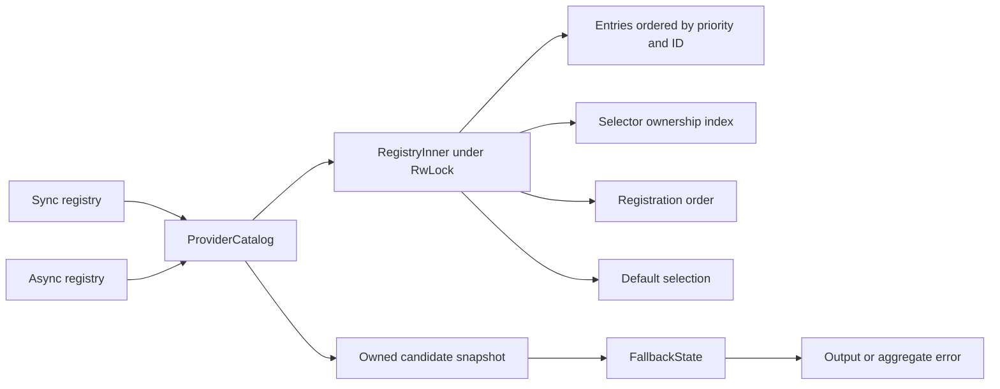

# Qubit SPI Design

[中文版](design.zh_CN.md) · [User Guide](user_guide.md) · [README](../README.md)

This document describes the 0.11 API and its implementation contracts. It is for
maintainers and domain-crate authors. The user guide contains runnable integration
examples; this document records why registration, selection and creation remain
separate and what future changes must preserve.

## Responsibilities

`ServiceSpec` binds configuration and domain error types. Sync and async output
capabilities are separate; one family can support both without forcing the same
output type. `ProviderMetadata` and the leaf factory traits compose through blanket
`ProviderDefinition` implementations. A domain crate owns the business interface
and any global facade; an application owns registration and default policy.

A resolver is a composition of leaf providers with aggregate errors, not another
leaf provider. It returns the successful output directly. URI parsing, credentials,
output identity checks and client caching belong to domain adapters. For example,
filesystem registries can validate output identity in a wrapper, and a rooted local
provider can return a clone of its existing filesystem handle. SPI does not infer
those domain contracts from metadata.

## Catalog and Snapshot Boundaries

The diagram shows shared algorithms, not shared registration state between sync
and async registries. Each catalog instance owns an `Arc<RwLock<RegistryInner
>>`;
registry clones share that instance. Sync and async registries remain independent.
Entries share immutable descriptors and provider objects using `Arc`. Registration
order is separate from automatic order `(Reverse(priority), canonical ID)`.
`Reverse<i32>` handles minimum priority without integer-negation overflow.

Registration first invokes `descriptor()` outside the write lock. It then acquires
one write guard, checks canonical ID and every alias against existing ownership,
and inserts all indexes atomically. Reentrant metadata callbacks can register
other providers; conflict checks therefore happen after the callback. A conflict
inserts none of the attempted provider’s selectors, and the rejected provider
drops after the guard. A metadata panic also leaves the attempted registration
unapplied. Completed reentrant callback changes are not rolled back.

Explicit resolution holds one read guard. Default resolution clones the selection
and resolves candidates under the same guard. `resolve_default_snapshot()` returns
that pair even when resolution fails; callers must not combine a separate
`default_selection()` read with a later resolve when validating configuration.
`resolve()` is the convenience operation returning only the captured result.

Descriptor snapshots and Debug metadata use the same conversion helper. Debug
captures descriptors/default under one guard and formats the owned data after
unlocking. Provider factories and async future polling never run under the catalog
lock. Tests also cover reentrant metadata and destruction to protect this boundary.

A resolver owns a boxed candidate slice and fallback policy. Later registration or
default changes cannot alter that slice. Provider objects themselves remain shared;
a snapshot is not a deep copy of mutable backend state. Resolver cloning copies the
slice and clones its shared handles, so its cost is linear in the candidate count.

## Selection and Failure State Machine

IDs are already canonical ASCII tokens. Selectors normalize caller input; aliases
share the canonical ID lookup namespace. Alias validation parses lazily and stops
consuming the caller's iterator at the first invalid or conflicting item. Static
macro metadata is checked at compile time.

Named selection admits one provider. Strict chains reject all unknown occurrences,
preserving their diagnostic order; lenient chains skip unknowns but reject an empty
candidate set. Matched provider identities are deduplicated in first-encounter order.
Automatic selection uses descending priority and ascending canonical ID.

`FallbackState<E>` is the common sync/async diagnostic state machine:

1. Invoke the current candidate; success returns its output immediately.
2. Record a failure with the actual canonical provider ID and typed domain error.
3. If no candidate remains, return `Exhausted`.
4. Otherwise, if policy disallows the failure kind, return `StoppedByPolicy`.
5. Otherwise, try the next candidate.

The exhaustion check precedes policy rejection. `Never` stops at the first failure
when another candidate exists. `OnAbsence` admits Unsupported/Unavailable;
`OnAnyError` admits every current leaf classification. Panics are not failures for
this policy. Missing selectors never fabricate creation attempts. Aggregate errors
are nonempty; the decisive attempt is the last actual failure and `is_absence()`
requires every actual failure to be absence-related.

## Async Lifetime and Cancellation

Async registration/resolution are synchronous metadata operations. The resolver
awaits one sendable leaf future at a time without choosing an executor. Config is
borrowed and must be Sync; output is Send + 'static. Dropping an unpolled resolver
future invokes no factory. Cancellation after polling drops the active leaf future
and does not advance fallback, including after earlier candidates have failed.

Cancellation does not roll back external effects or stop independently spawned
tasks. A leaf panic before returning its future or during polling propagates.
Every create invokes a factory; providers may reuse an existing resource. SPI
neither caches output nor guarantees a fresh allocation. Errors in subsequent
service operations are outside construction fallback.

## Performance Decisions

The benchmark suite separates registration, named/chain/automatic/default
resolution, resolver clone, alias parsing, successful creation, fallback, complete
exhaustion, ready/pending async creation, and read/write contention. Registration
contention resets a bounded registry each batch and excludes thread startup/join.
Alias fixtures prepare source strings before timing; error construction remains
part of the corresponding creation workload.

An `Arc<[RegistryEntry
]>` candidate representation was evaluated in three runs.
It greatly reduced 8/64-candidate clone cost, but repeatedly regressed named,
automatic and successful creation paths beyond the selected 5% adoption threshold.
The boxed representation was retained. This is a measured tradeoff, not a claim
that shared slices are universally slower. A future proposal should repeat both
clone and resolution/creation workloads on its target environment.

Lazy alias parsing was adopted after separate tests and three benchmark runs. It
removes the copied raw-string vector, preserves normalized order and diagnostics,
and stops consuming after the first error. This iterator-consumption behavior is
intentional. Neither candidate introduced a production dependency or runtime feature.

## Validation and Maintenance

- Public integration tests cover selection, failure classification, registration
  atomicity, reentrant callbacks/destruction, panic, resource sharing, concurrent
  default snapshots and all three cancellation boundaries.
- Doctests include runnable examples for all public named types and compile-fail
  checks for intentionally unavailable APIs/representations.
- The independent fuzz oracle uses a linear vector rather than production indexes.
  It checks full call/attempt histories, policy termination and historical snapshots.
  Named boundary seeds are retained; random exploration artifacts are temporary.
- Markdown checks extract marked Rust blocks from each language independently,
  require the declared inventory, and run real Cargo scenarios. Missing scenarios,
  ignored fences and stale methods fail validation. Rust examples must not be
  replaced by unrelated duplicate source fixtures.
- Package validation uses an actual Cargo archive and builds/tests its extracted
  contents without a checkout path patch. This prevents tests from depending on
  excluded fuzz sources or shared CI submodules.
- CI runs alignment-sensitive lint/test/documentation checks plus the project
  documentation and archive contracts. Changes must also be exercised through
  filesystem, MIME and Magika consumers with their actual dependency paths checked.

No unregister/freeze API, successful-output metadata wrapper, dependency injection
container or dynamic plugin loader is added without a concrete domain need.
Keep the catalog and failure state machine shared; keep domain-specific validation
in adapters. Any future public API change must update both languages, executable
examples and affected downstream crates together.
