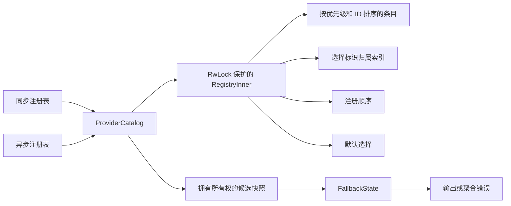

# Qubit SPI 设计说明

[English](design.md) · [用户指南](user_guide.zh_CN.md) · [README](../README.zh_CN.md)

本文说明 0.11 API 的架构与实现契约，面向维护者和领域 crate 作者。可运行的集成
示例见用户指南；本文重点说明为什么要分开注册、选择和创建，以及后续修改必须
保留的行为。

## 职责划分

`ServiceSpec` 绑定配置和领域错误，同步与异步能力分别绑定输出类型。同一服务族
可以同时支持两种能力，而不必强迫输出类型相同。元数据和叶级工厂通过
`ProviderDefinition` 的 blanket implementation 组合。领域 crate 定义业务接口和
全局门面，应用负责注册与默认策略。

解析器组合多个叶级工厂并返回聚合错误，因此不再充当叶级服务提供者。成功输出
直接交给调用方。URI、凭证、输出身份校验和客户端缓存属于领域适配层。例如，
文件系统注册表可以通过包装器验证输出身份，指定根目录的本地服务提供者也可以
返回已有文件系统句柄的克隆。SPI 不会根据元数据推断这些业务约束。

## 目录与快照边界

图中共用的是算法，并非同步与异步注册内容。每个目录实例持有
`Arc<RwLock<RegistryInner
>>`；注册表的克隆共享该实例，但同步和异步注册表彼此
独立。条目通过 `Arc` 共享不可变描述符和服务提供者对象。注册顺序与自动选择的
`(Reverse(priority), canonical ID)` 顺序分开维护。`Reverse<i32>` 无需对优先级取负，
因此能正确处理最小整数。

注册首先在写锁外调用 `descriptor()`，随后取得一个写锁，检查规范 ID 和所有别名
的归属，再原子地插入各索引。元数据回调可能重入并注册其他服务提供者，所以冲突
检查必须位于回调之后。冲突不会插入本次注册的任何选择标识，被拒绝对象在释放锁后析构。
元数据 panic 也不会应用本次注册；回调重入后已完成的变更不会回滚。

显式解析在一个读锁内完成。默认解析在同一个读锁内克隆选择配置并解析候选；
即使解析失败，`resolve_default_snapshot()` 仍返回该选择与结果。配置校验需要
精确默认值时，不能把独立的 `default_selection()` 查询和稍后的解析拼在一起。
`resolve()` 是仅返回这次解析结果的便利方法。

描述符快照和 Debug 元数据使用同一个转换辅助函数。Debug 在一个锁内捕获描述符
与默认选择，解锁后才格式化。工厂调用和异步 future 的 poll 不持有目录锁；测试
还覆盖元数据和析构重入，保护这一边界。

解析器持有装箱的候选切片和回退策略。后续注册或默认选择变更不会改变候选切片。
服务提供者对象仍然共享，快照不会深拷贝后端的可变状态。克隆解析器会复制切片并
克隆共享句柄，成本随候选数量线性增长。

## 选择与失败状态机

ID 必须已经是规范 ASCII 标识。选择标识会归一化输入，别名与规范 ID 共用查找
命名空间。别名采用惰性解析，在第一个无效项或冲突项处停止消费调用方迭代器；
静态宏的元数据则在编译期检查。

具名选择只接受一个服务提供者。严格链保留所有未知标识的出现顺序并整体拒绝；
宽松链忽略未知项，但没有候选时仍报错。匹配到的服务提供者按第一次出现的顺序
去重。自动选择按优先级降序、规范 ID 升序排序。

同步与异步解析器共用 `FallbackState<E>`：

1. 调用当前候选，成功则立即返回输出。
2. 失败时记录实际调用的规范 ID 和类型化领域错误。
3. 如果没有剩余候选，返回 `Exhausted`。
4. 如果还有候选但策略不允许继续，返回 `StoppedByPolicy`。
5. 否则尝试下一候选。

耗尽判断先于策略拒绝。仍有候选时，`Never` 在首次失败后停止；`OnAbsence` 允许
Unsupported/Unavailable，`OnAnyError` 允许所有当前叶级错误类别，但不捕获 panic。
未知标识不会凭空生成创建记录。聚合错误始终非空，决定性记录就是最后一次实际
失败；只有所有实际失败都属于缺席类别时，`is_absence()` 才为真。

## 异步生命周期与取消

异步注册和解析仍是同步的元数据操作。解析器依次等待可发送的叶级 future，不绑定
执行器。配置被借用且需要 Sync，输出需要 Send + 'static。未经 poll 就丢弃解析器
future，不会调用工厂。poll 后取消会丢弃当前叶级 future，不会继续回退；此前已有
候选失败时也一样。

取消不保证撤销外部副作用或停止独立启动的任务。叶级方法返回 future 前的 panic
以及 poll 时的 panic 都直接传播。每次创建都会调用工厂，工厂可以复用已有资源；
SPI 不缓存输出，也不保证新分配。创建成功后的服务操作错误不属于创建回退范围。

## 性能决策

基准分别测量注册、具名/链/自动/默认解析、解析器克隆、别名解析、成功创建、回退、
全部失败、Ready/Pending 异步创建和读写争用。注册争用每批使用新的有界注册表，
计时排除线程启动和 join。别名源字符串在计时前准备；错误构造仍计入相应创建负载。

曾用三轮基准评估 `Arc<[RegistryEntry
]>`。它显著降低了 8/64 个候选的克隆成本，
但具名、自动解析和成功创建路径反复超过选定的 5% 退化门槛，因此保留装箱切片。
这是一项基于测量的取舍，不代表共享切片在所有环境都更慢。后续若重新提出方案，
应在目标环境同时比较克隆与解析、创建负载。

别名惰性解析经过独立测试和三轮基准后采用。它去掉复制原始字符串的中间向量，
保留归一化顺序和诊断，并在第一个错误处停止消费输入；这一迭代行为变化是明确的
设计选择。两项候选都没有引入生产依赖或运行时 feature。

## 验证与维护

- 公开集成测试覆盖选择、错误分类、注册原子性、回调和析构重入、panic、资源共享、
  并发默认快照，以及三个取消阶段。
- 所有公开具名类型都有可运行 doctest，并保留验证不可用 API 或表示方式的编译失败测试。
- 独立 fuzz 模型使用线性向量，不复制生产索引，核对完整调用与错误序列、终止原因和
  历史快照。保留命名边界种子，随机探索产物放入临时目录。
- Markdown 检查按语言独立提取带标记的 Rust 代码，校验完整清单后执行真实 Cargo
  场景。删除整个场景、忽略代码块或使用过期方法都会失败，不用无关副本替代原文代码。
- 发布包验证使用真实 Cargo 归档，在解包后构建和测试，不注入指向 checkout 的路径
  补丁，防止测试依赖未发布的 fuzz 源码或共享 CI 子模块。
- CI 执行格式相关 lint、测试、文档及项目专属的示例和归档检查。修改还需要经过
  文件系统、MIME、Magika 消费方验证，并确认它们实际解析到本次依赖源码。

没有具体领域需求时，不增加注销/冻结 API、成功输出元数据包装、依赖注入容器或
动态插件加载器。继续共用目录和失败状态机，把领域专用校验留在适配层。未来若
修改公共 API，必须同步两种语言、可执行示例和受影响下游。
